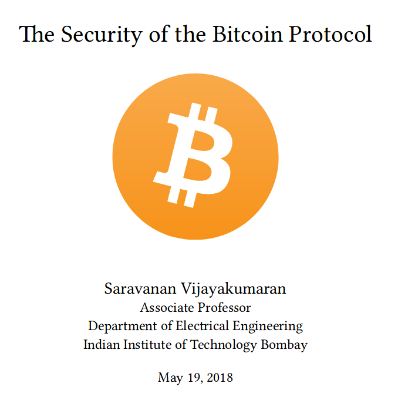
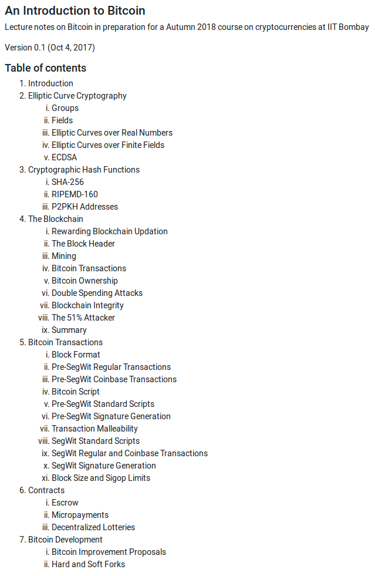

# Bitcoin

## Books about Bitcoin

  - **Bitcoin and Cryptocurrency Technologies: A Comprehensive Introduction** by *Arvind Narayanan, Joseph Bonneau, Edward Felten, Andrew Miller, and Steven Goldfeder.* Princeton University Press, 2016.
      
      This book is a good starting point for learning about Bitcoin.

      + A free pre-publication draft is available at [http://bitcoinbook.cs.princeton.edu/](http://bitcoinbook.cs.princeton.edu/). The [hardcover version](https://www.amazon.in/dp/0691171696) has better formatting than the draft but it is expensive.
      + Video lectures by the authors based on the book content are available on Youtube.

        <iframe width="320" height="180" src="https://www.youtube.com/embed/fOMVZXLjKYo" frameborder="0" allow="accelerometer; autoplay; encrypted-media; gyroscope; picture-in-picture" allowfullscreen></iframe>
      
      + A [Coursera course](https://www.coursera.org/learn/cryptocurrency) based on the book also runs regularly. It takes about 18 hours to complete.

  - **Mastering Bitcoin: Programming the Open Blockchain** by *Andreas Antonopoulos*. 2nd Edition, O'Reilly Media, Inc., 2017.

      This book has a broader and in-depth coverage of Bitcoin targeted towards developers. It has shell command examples which allow one to interact with the Bitcoin network.

      + The content of the book is available for free download at [https://github.com/bitcoinbook/bitcoinbook](https://github.com/bitcoinbook/bitcoinbook).
      + A [paperback version](https://www.amazon.in/dp/9352135741) is also available.

## From yours truly

  - **The Security of the Bitcoin Protocol** by *Saravanan Vijayakumaran*. May 2018

    A 27-page introduction to Bitcoin written by me for a paid consulting gig from [Zebpay](www.zebpay.com). Click [here](https://www.ee.iitb.ac.in/~sarva/bitcoin/zebpay-whitepaper.pdf) for the pdf.

    
    
  - **An Introduction to Bitcoin** by *Saravanan Vijayakumaran*. Oct 2017

    I took a year-long sabbatical in 2017 to research Bitcoin and write a book about it. These notes are the first draft of the book. Click [here](https://www.ee.iitb.ac.in/~sarva/bitcoin/bitcoin-notes-v0.1.pdf) for the pdf.

    

  - **NCC 2018 Bitcoin Tutorial Video**
    
    Youtube video of a two-hour Bitcoin tutorial I gave at the National Conference on Communications in Hyderabad on Feb 25, 2018.

    <iframe width="320" height="180" src="https://www.youtube.com/embed/tySLqNScRIc" frameborder="0" allow="accelerometer; autoplay; encrypted-media; gyroscope; picture-in-picture" allowfullscreen></iframe>
